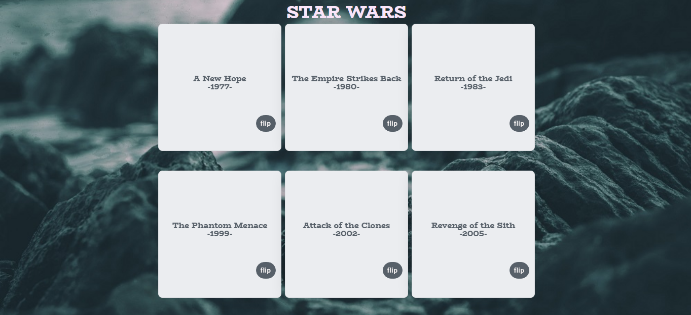

<div align="center">
  <h1>Star Wars</h1>
  <p>A website based on Star Wars's API</p>
</div>

## About
Star Wars is a web application where you can flip through cards to view the first six star wars movies' directors and planets.

Live demo: https://catherinenjenga.github.io/Star_Wars/



## Features

### Asynchronous fetches
* Pulls in data about star wars movies from [SWAPI](https://swapi.dev/)

## Getting Started

Follow the installing instructions below to run the project on your local machine

### Dependencies

The game is written in vanilla JavaScript, hence requires to run on a modern browser with ES6 standards support

### Installing

1. Download ZIP or clone this repo
```
> git clone https://github.com/CatherineNjenga/Star_Wars.git
```
2. Navigate to the folder "docs" and open index.html

## Built With

### Frontend

* Vanilla JavaScript
* HTML/CSS

### Backend

* Star Wars API
